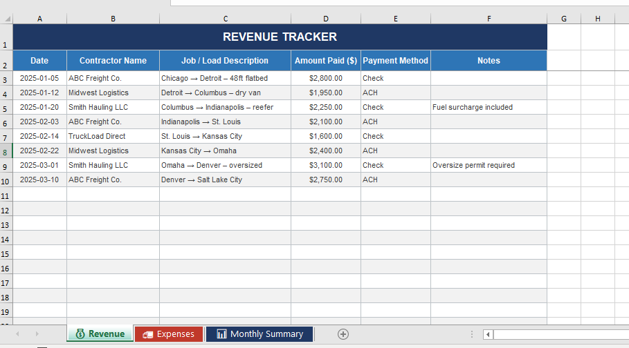
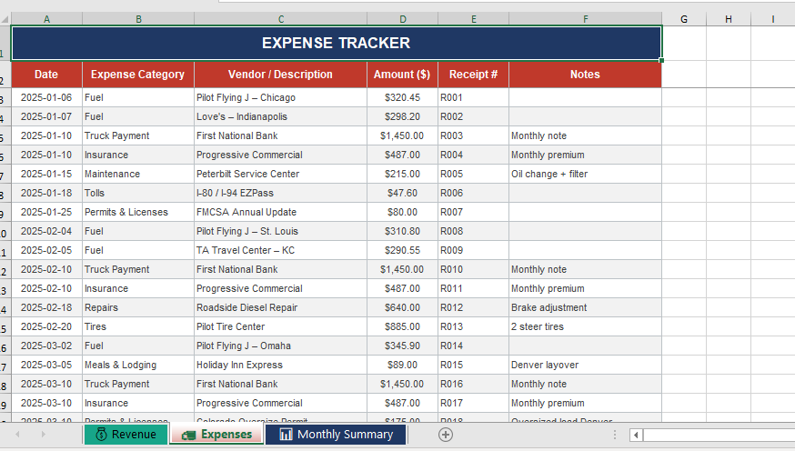
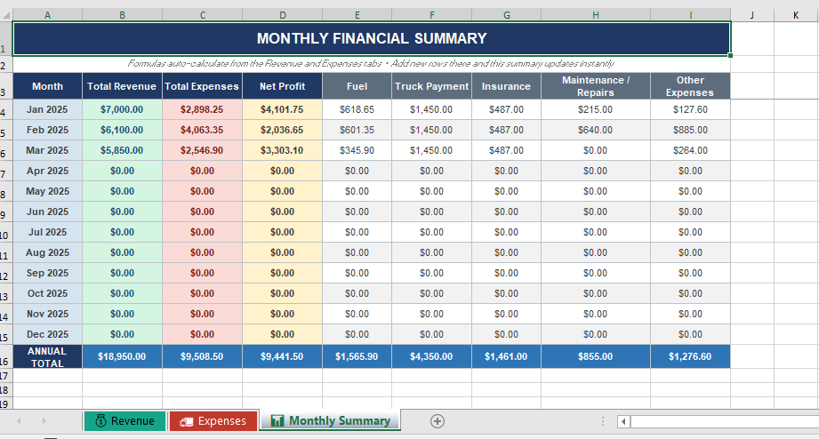

# Automated-Business-Tracker

## Client Request. 

I’m looking for someone experienced with Google Sheets to build a simple but well-structured spreadsheet for my husband’s small trucking business.

The goal is to track revenue, expenses, and monthly totals in one organized document.

The sheet should contain 3 tabs:

1. Revenue Tab
This tab will track incoming revenue from different contractors.
Columns should include:
• Date
• Contractor Name 
• Job / Load Description (optional but helpful)
• Amount Paid
• Notes (optional)

2. Expense Tab
This tab will track business expenses.
Columns should include:
• Date
• Expense Category (Gas, Maintenance, Permits, Truck Payment, Insurance, Repairs etc.)
• Vendor / Description
• Amount
• Notes

3. Monthly Summary Tab
This tab should automatically calculate totals from the other two tabs.

It should show:
• Total Revenue per Month
• Total Expenses per Month
• Expense Breakdown by Category (Gas, Maintenance, Permits, Truck Payments, Insurance, etc.)
• Net Profit per Month (Revenue – Expenses)

Important:
• The sheet should be simple and easy to maintain
• All totals should calculate automatically using formulas
• It should be structured so we can easily add new rows each month
• Clean formatting and clear organization is important
• Dropdown categories for expenses

This should be a fairly quick project for someone comfortable with Google Sheets formulas.

Please include:
• Examples of similar spreadsheets you’ve built
• Estimated time to complete

## What to do.

How would you have helped solve this? write out the fastest and smart approach that convinces the client to give you the job on upwork

## Images

Revenue Tab — tracks date, contractor, load description, amount, payment method, and notes. Payment method is a dropdown (Check, ACH, Wire, Cash, etc.). Rows are pre-formatted down to row 200 so you just type and go.

🚛 Expenses Tab — tracks date, category, vendor, amount, receipt number, and notes. Expense Category is a dropdown with 14 preset options (Fuel, Truck Payment, Insurance, Maintenance, Repairs, Permits, Tolls, Tires, and more) so entries stay consistent.

📊 Monthly Summary Tab — auto-calculates everything the moment you add a row to the other tabs. Shows Total Revenue, Total Expenses, and Net Profit for each month, plus a breakdown by Fuel, Truck Payment, Insurance, Maintenance/Repairs, and Other. There's an Annual Total row at the bottom.

